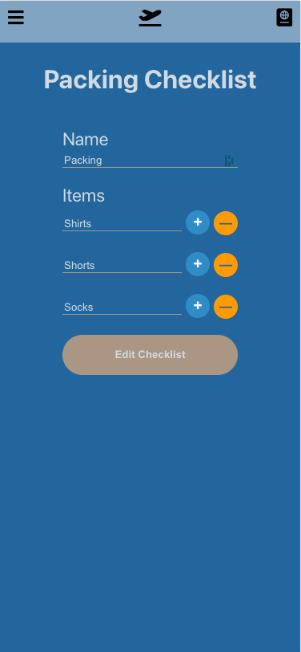
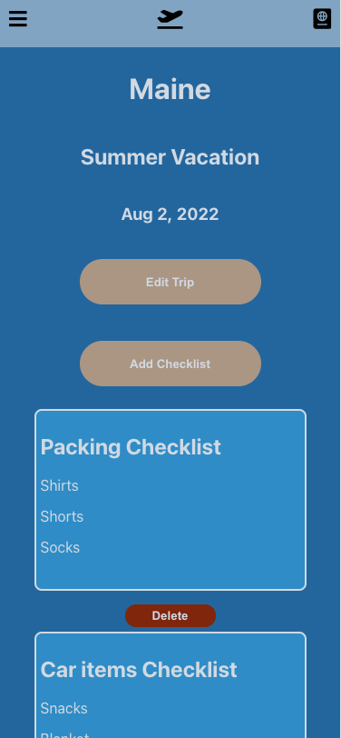
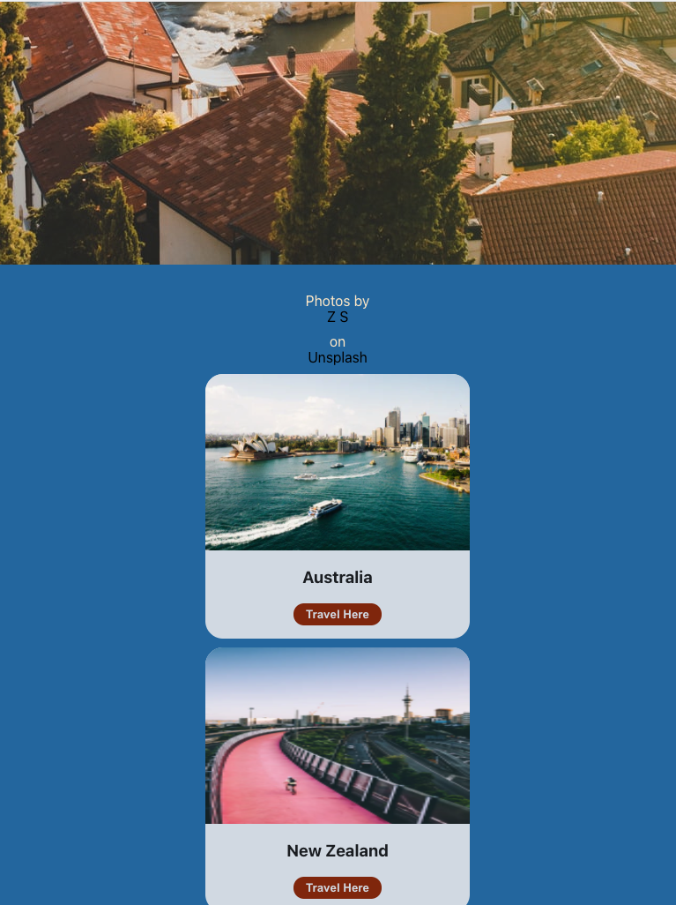
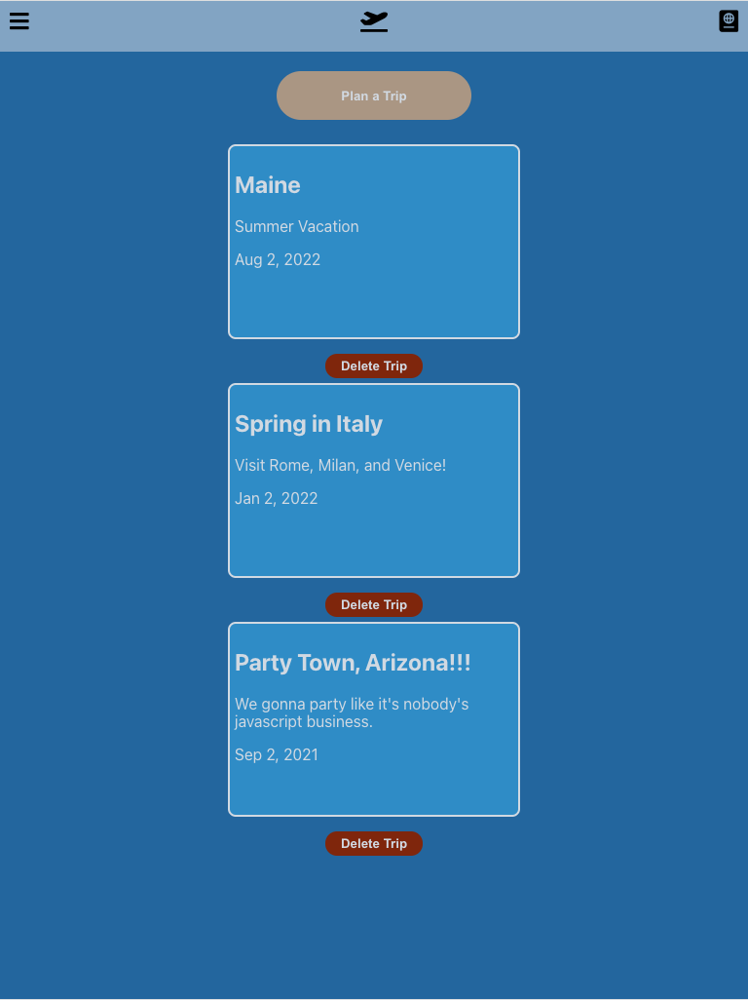

# [WE! Travel](https://we-travel.herokuapp.com/)

WE! makes it easy to see all of your travel information in one place. See your budget, checklists, and travel schedule all in one, convenient place.

> ### "***Most travel websites are optimized for conversion, not planning.***" - AskWonder

## Background

Did you know U.S. travelers visit over 140 sites on average when planning a trip. According to [AskWonder](https://askwonder.com/research/biggest-problems-modern-day-travel-planning-riunb1y6i), “most travel websites are optimized for conversion, not for planning and even then, tools for saving for later, sharing, and comparing are generally not there.”

### The WE! Travel Team

## Getting Started

1. [Launch the app](https://we-travel.herokuapp.com/)
2. Sign up
3. Browse interesting locations and start a trip plan

## Screenshots

## Technologies Used

- [React](https://reactjs.org/)
- JavaScript
- HTML
- CSS
- [MongoDB](https://www.mongodb.com)/[Mongoose](https://mongoosejs.com/docs/)
- [Node.js](https://nodejs.org/en/)/[Express](https://expressjs.com/)
- [Unsplash API](https://unsplash.com/developers)
- [REST Countries API](https://restcountries.eu/)
- [dateformat](https://www.npmjs.com/package/dateformat)
- [bcrypt](https://www.npmjs.com/package/bcrypt)

For a full list of dependencies please view the [package.json](package.json).

## Next Steps

- Local weather forecast
- Add friends and groups
- Vote on activities
- In-app chat
- View currency exchange rate

For a full list of icebox features, check out the [Trello project board](https://trello.com/b/npFmpR9q/ga-sei-unit-3-project-we-travel).